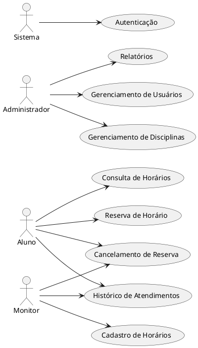

## Casos de Uso

### Descrição:

#  Diagrama de Casos de Uso – Sistema de Monitoria Acadêmica

##  Atores
- **Aluno**
    - Consulta monitorias

- **Monitor**
    
    - Gerencia monitorias
    - Acompanha histórico

- **Administrador**
    - Gerencia usuários
    - Gerencia disciplinas
    - Gera relatórios
    - Reserva horários
    - Cancela reservas

- **Sistema (Automatizado)**
    - Realiza autenticação
    - Envia notificações
    - Valida dados

---

##  Casos de Uso por Funcionalidade

###  Contas
- Criação de Conta
- Login
- Alteração de Conta
- Recuperação de Senha
- Exclusão Lógica
- Visualização de Conta

###  Perfil do Usuário
- Edição
- Visualização

###  Monitorias
- Consulta de Horários Disponíveis
- Cancelamento de Reserva
- Histórico de Atendimentos

###  Disciplinas (Admin)
- Cadastro
- Edição
- Exclusão
- Consulta (Aluno/Monitor)

###  Notificações
- Confirmação de Reserva
- Alterações de Horários

###  Relatórios (Admin)
- Relatório de Reservas por Disciplina
- Relatório de Atendimentos por Monitor

---

## Fluxos de Interação

###  Criação de Conta (Aluno/Monitor/Admin)

**Fluxo Básico:**
1. Usuário fornece e-mail, senha e confirma os dados.
2. Sistema valida os dados.
3. Sistema criptografa a senha e persiste os dados.
4. Sistema envia e-mail de verificação.
5. Usuário confirma o e-mail dentro do prazo.
6. Sistema confirma cadastro e redireciona para login.

**Fluxos Alternativos:**
- E-mail inválido → exibir erro.
- Senha não atende às regras → exibir erro.
- Link de verificação expirado → solicitar novo cadastro.

---

## Login

**Fluxo Básico:**
1. Usuário fornece e-mail e senha.
2. Sistema autentica os dados.
3. Sistema redireciona o usuário para a página inicial de acordo com seu tipo.

**Fluxos Alternativos:**
- Dados inválidos → exibir mensagem de erro.
- Primeiro acesso → redirecionar para página de edição de perfil.

---

### Reserva de Monitoria (Aluno)

**Fluxo Básico:**
1. Aluno seleciona a disciplina e o monitor desejado.
2. Sistema exibe horários disponíveis.
3. Aluno escolhe horário e confirma a reserva.
4. Sistema registra a reserva e envia notificação.

**Fluxos Alternativos:**
- Horário já reservado → sistema sugere outro horário.
- Limite de reservas excedido → sistema bloqueia nova reserva.

---

###  Gerenciamento de Horários (Monitor)

**Fluxo Básico:**
1. Monitor acessa seu painel.
2. Sistema valida e persiste os dados.
3. Sistema exibe relatórios de reservas feitas por alunos.

**Fluxos Alternativos:**
- Horário inválido → Se o monitor tentar cadastrar um horário fora do intervalo permitido (ex: antes das 08h ou após as 22h), o sistema exibe uma mensagem de erro e bloqueia o cadastro.
- Sobreposição de horários → Se o horário cadastrado conflitar com outro já registrado (mesmo dia/hora/disciplina), o sistema alerta o monitor e solicita uma correção.

---

###  Gestão de Disciplinas e Usuários (Admin)

**Fluxo Básico:**
1. Admin acessa o painel administrativo.
2. Pode criar, editar ou excluir disciplinas.
3. Pode cadastrar, editar ou excluir usuários.
4. Sistema gera relatórios consolidados.

**Fluxos Alternativos:**
- E-mail de usuário duplicado → Se o admin tentar cadastrar um usuário com um e-mail já existente, o sistema não permite e solicita um e-mail diferente.
- Dados obrigatórios não preenchidos → Ao tentar cadastrar ou editar uma disciplina ou usuário sem preencher campos obrigatórios (ex: nome, e-mail, CPF), o sistema alerta e impede o envio.

