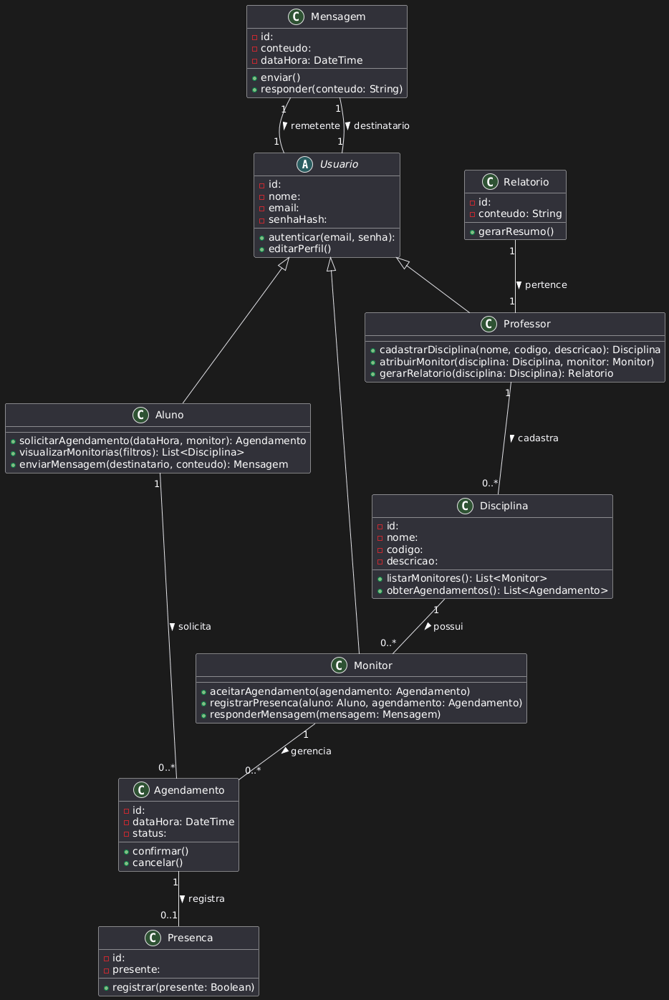

### Criação de uma conta no sistema

* Atores:

	- Usuário
	- Sistema

- Pré-Condições:
	- Nenhuma

* Fluxo Básico:
    1. Usuário fornece e-mail, senha e confirmações
    2. Dados do Usuário são validados pelo Sistema
    3. Dados do Usuário são encriptados pelo Sistema
    4. Dados do Usuário são persistidos pelo Sistema
    5. Sistema gera um link com prazo de expiração
    6. Sistema envia e-mail de verificação, com o link, para o Usuário
    7. Usuário confirma o e-mail antes do link expirar
    8. Sistema confirma que o Cadastro do Usuário foi realizado com sucesso
    9. Sistema redireciona o Usuário para a página de Entrada

- Fluxos Alternativos:
	- 2a. E-mail do Usuário é inválido
		2a1. Sistema exibe mensagem de erro
	- 2b. Senha do Usuário não respeita regras de segurança
		- 2b1. Sistema exibe mensagem de erro
	- 3a. Usuário tenta confirmar o e-mail depois de o link expirar
		- 3a1. Sistema sugere que o Usuário realize um novo Cadastro

### Entrada do usuário no sistema

- Atores:
	- Usuário
	- Sistema

- Pré-Condições:
	Usuário deve estar cadastrado

- Fluxo Básico:
    - 1. Usuário fornece e-mail e senha
	- 2. Sistema autentica o Usuário
	- 3. Sistema redireciona o Usuário para a página inicial

- Fluxos Alternativos:
	- 2a. Dados do Usuário Inválidos
		- 2a1. Sistema exibe mensagem de erro
	- 3a. Primeio acesso do Usuário
		- 3a1. Sistema redireciona o Usuário para a página de edição de perfil

		
## Explicação detalhada das classes e processos:

* Usuário (abstract)

* Classe base para todos os usuários (Aluno, Monitor, Professor).

* Atributos comuns: id, nome, email, senhaHash.

* Métodos básicos: autenticar (login), editarPerfil.

### 2 Alunos

* Herda de Usuario.

* Pode solicitar agendamento com monitores.

* Visualiza monitorias disponíveis.

* Envia mensagens para monitores.

### 3. Monitor

* Herda de Usuario.

* Pode aceitar agendamentos solicitados pelos alunos.

* Registra presença do aluno na monitoria.

* Responde mensagens recebidas.

### 4. Professor

* Herda de Usuario.

* Cadastra disciplinas no sistema.

* Atribui monitores às disciplinas.

* Gera relatórios com dados das monitorias.

### 5. Disciplina

* Representa uma matéria ou curso com monitoria.

* Possui nome, código, descrição.

* Relaciona-se com vários monitores.

* Permite obter agendamentos para acompanhamento.

### 6. Agendamento

* Marca um encontro entre aluno e monitor.

* Atributos: dataHora do atendimento, status (Pendente, Confirmado, Cancelado).

* Pode ser confirmado ou cancelado.

### 7. Presença

* Registra se o aluno compareceu ao atendimento.

* Atributo “presente” (sim/não).

* Associada a um agendamento.

### 8. Mensagem

* Comunicação entre usuários (aluno, monitor, professor).

* Guarda conteúdo e data/hora.

* Tem remetente e destinatário (do tipo Usuario).

* Pode ser enviada e respondida.

### 9. Relatório

* Criado pelo professor para avaliar o desempenho das monitorias.

* Contém dados resumidos de agendamentos e presenças.

* Ajuda na gestão e tomada de decisão.

* Relacionamentos principais:

* Herança: Aluno, Monitor e Professor são tipos de Usuario.

### Associações:

* Aluno faz vários Agendamentos com Monitores.

* Monitor gerencia os Agendamentos.

* Presença é ligada a um Agendamento.

* Professor cadastra várias Disciplinas.

* Disciplina tem vários Monitores.

* Mensagem conecta dois Usuarios.

* Relatório pertence a um Professor.

# Mapa mental Monitoria

