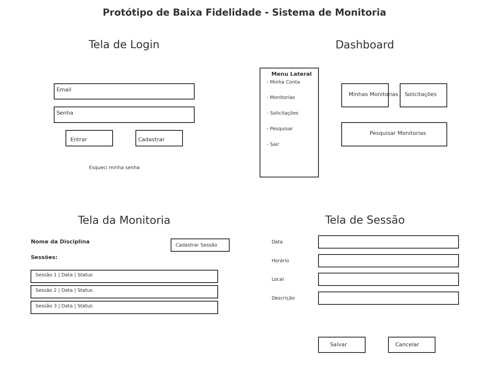

## Introdução

A construção do protótipo de alta fidelidade auxilia a equipe de desenvolvimento a encontrar um nível de detalhes abrangentes, extrair funcionalidades, testar usabilidade, e também fornece uma base para o gerenciamento do projeto pois com o protótipo é possível realizar estimativas de quanto tempo será necessário desempenhar em cada funcionalidade.

## Metodologia

Iniciamos o projeto através dos levantamentos iniciais da equipe, após discussões a ferramenta utilizada foi Python + Matplotlib, ou seja, foi gerado programaticamente.

## Protótipo Baixa Fidelidade.
 
 

---

## Autor(es)

| Data     | Versão | Descrição                            | Autor(es)                                                                            |
| -------- | ------- | -------------------------------------- | ------------------------------------------------------------------------------------ |
| 16/09/25 | 1.0     | Criação do documento                 |     Roberto Ramos          |
| 16/09/25 | 1.0     | Criação do documento                 |     Luis Cesar Dantas      |
| 16/09/25 | 1.0     | Criação do documento                 |     João Lucas Loss        |
